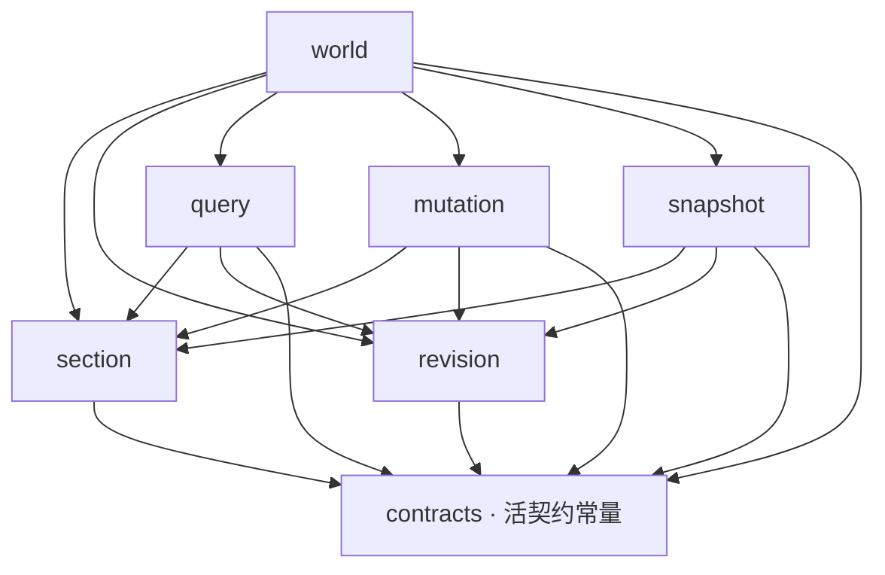

# LumioVoxelEngine 模块架构（模块总入口）

> **公共契约来源**：体素公共语义的唯一真值是架构仓的活契约 `engine/wire/voxel-world-v1.json`（`contractId: lumio.voxel-world.v1`），本仓保存逐字节副本并用一致性测试证明未漂移（[0013](../.spec/decisions/0013-voxel-world-contract-and-section-rename.md)、[`features/voxel-section-chunk.md`](../.spec/knowledge/features/voxel-section-chunk.md)）。
> **设计说明**：架构仓 `.spec/knowledge/features/voxel.md` 的 M1 ~ M10 模块图是本仓模块划分的上位口径；本文只回答「本仓这几个目录各自负责哪一段、边界在哪」。
> **本文定位**：模块文档总入口。只冻结本仓的模块边界、依赖图、状态所有权与线程/队列约束，不复制契约字段布局。
> **分层命名**：16×16×16 = 4096 格的数据单元叫 **Section**（`SectionId`、`SectionRevision`），是最小同步单位、驻留单位和版本锚点；**Chunk** 是 16 个 Section 竖着摞成的列容器（16×256×16），只作存档打包、按列计算和流式批量请求的单位，不携带数据、不持有独立 revision。
> **内部决策**：Cut 与 CaptureRef 见 [0001](../.spec/decisions/0001-snapshotcut-vs-capture-ref.md)；CommitBatch 见 [0002](../.spec/decisions/0002-barrier-commit-batch.md)；分层与依赖图见 [0003](../.spec/decisions/0003-dependency-graphs-and-layering.md)；Snapshot Barrier 见 [0004](../.spec/decisions/0004-snapshot-short-barrier-vs-quiesce.md)；Origin Token 与队列矩阵见 [0005](../.spec/decisions/0005-origin-token-and-queue-matrix.md)；crate map 见 [0006](../.spec/decisions/0006-crate-map.md)。

## 1. 设计目标与范围

### 1.1 设计目标

- 把根 [README.md](../README.md) 声明的 VoxelWorld 能力拆成**单一状态所有者、单向编译依赖、可独立测试、故障边界清晰**的模块。
- 让开发者只读一个模块 README 就能回答：模块负责什么、不负责什么、拥有哪些状态、接受哪些输入、在哪个执行上下文运行、失败如何分类和恢复。

### 1.2 范围

- **本目录只收有代码的模块。** 每个模块一个目录，目录内的 `README.md` 是该模块的边界契约；`voxel.md` 里尚未开工的模块（M3 光照、M4 网格生成与零拷贝交付、M10 存档可读性与离线检查）不预建空目录，开卡时再建。
- 模块 README 描述**设计现状**，不是新的公共契约来源，也不是实现任务清单。待执行工作在 `.spec/tasks/`，决策在 [`.spec/decisions/`](../.spec/decisions/README.md)，公共语义在活契约。

## 2. 系统上下文与仓库边界

- **本仓拥有**：VoxelWorld 实例、Chunk / Section / Block 分层与坐标、World/Section Revision、Query、Mutation、Voxel Capture/Diff 载荷、驻留与物理检测投影。
- **Host 拥有**：进程、连接、Wall Clock、WorldSlot 和实例创建/销毁编排；本仓只提供实例内部状态转换和稳定 Port。
- **Runtime 拥有**：Logical Tick、Phase Graph、Coordinator、GameWorld、Replication 语义、跨域 `SnapshotCut` 和跨 World 决策；本仓不创建或直接修改 ECS，也不拥有 Session Cut。
- **SDK 拥有**：Native 聚合加载与托管入口；本仓只是被聚合的 Rust crate 集合，不自持 Loader。
- **运行时关系**：`LumioEngineSDK Native -> Host Loader -> VoxelWorld instance -> Runtime IVoxelWorldPort`。

所有模块都必须遵守以下约束：

1. Server 权威 VoxelWorld、Client VoxelReplicaWorld 与 LocalEmbedded 的两份世界不得共享对象引用、Section Buffer、锁、指针或 Revision 写入。
2. 权威修改只能在所属 Role 的 Simulation Barrier 提交；读操作也必须通过声明了预算、取消和 Revision 的 Port。
3. Native 锁内不得回调托管层或 Hot Gameplay；Worker 只能返回有界、可取消、带 Revision 的结果。
4. 消费方只能经版本化 `IVoxelWorldPort` 访问，不得读取内部 Section Storage。
5. 未 Ready 的 Section 必须返回契约四态里的 `Unchanged`、`Pending` 或 `Unavailable`，不能伪装为空世界，也不得被物化成空气。
6. 任何队列都必须声明容量、优先级、满载动作和 Metrics；禁止无界增长。

## 3. 模块地图与依赖图

禁止使用方向不明的「上游/下游」。边只表示：

- `depends on`：编译 / API 依赖。
- `called by`：控制流谁发起。
- `publishes / consumes`：事件和数据流。

### 3.1 模块地图

| 模块 | 一句话职责 | 层 | `voxel.md` 对应 | 物理 crate |
| --- | --- | --- | --- | --- |
| [section](section/README.md) | Section 坐标与键、方块编码、块存储三态、改动层、Dirty 与派发 | L1 基础数据 | M1 / M1a / M2 / M5 | `lumio-voxel-domain` |
| [revision](revision/README.md) | World/Section Revision、比较、读取令牌、Pin/COW 与保留 | L1 基础数据 | M6 | `lumio-voxel-domain` |
| [query](query/README.md) | 有界只读批量查询、缺 Section 四态、单格/矩形/列批量读与物理检测 | L3 领域 API | M7 / M7a | `lumio-voxel-ops`、`lumio-voxel-project` |
| [mutation](mutation/README.md) | 单域修改、Prepare/Reservation、幂等 Commit/Abort 和 CommitBatch | L3 领域 API | M6 | `lumio-voxel-ops` |
| [snapshot](snapshot/README.md) | VoxelCaptureRef、Diff、Canonical 编码、校验和恢复输入 | L3 持久化数据 | M9 | `lumio-voxel-ops` |
| [world](world/README.md) | 实例组装、Role/Context 生命周期、Barrier 入口、驻留与模块协调 | L5 组合根 | M6 / M8 | `lumio-voxel-world` |

逻辑模块不必与物理 crate 1:1；crate 落点见 [0006](../.spec/decisions/0006-crate-map.md)。Query/Mutation/Snapshot 属 `lumio-voxel-ops`，物理检测投影属 `lumio-voxel-project`，L2 ReadView/WriteSet/CommitBatch 属 `lumio-voxel-domain`。

### 3.2 Compile-Time DAG

`A --> B` 表示 A 编译/API 依赖 B。`section` 与 `revision` 是 sibling，不互调。`world` 是组合根；L0–L4 不得依赖 `world`。



补充约定：

- `contracts` 只提供活契约的常量表与自持水管（SHA-256、有界缓冲），不定义第二套 Schema、ID 或错误码。
- `revision` 不依赖任何上层 Voxel 模块，也不依赖 `section`。
- `section` 只拥有数据布局和 Section 内部状态，不暴露 Storage 引用，不递增公共 Revision。
- `query`、`mutation` 通过 ReadView / WriteSet 消费 `section`，不调用 `world` 的生命周期方法。
- `snapshot` 负责 CaptureRef、编码和解码输入；文件、fsync、原子替换和 WAL 落盘由 Host/Runtime 的持久化编排负责。
- 驻留与卸载调度当前收在 `world`；要独立成模块必须先有代码再建目录。

### 3.3 Runtime Control Flow

谁发起调用，谁完成调用。箭头是控制流，不是编译边。

```text
Host create/destroy
  -> world lifecycle
  -> init revision + section
  -> register query + mutation + snapshot

IVoxelWorldPort.query
  -> world Barrier / Context check
  -> query
  -> ReadView(section) + Stamp(revision)

IVoxelWorldPort.prepare / commit / abort
  -> world
  -> mutation
  -> CommitBatch publish { section payloads, Dirty, SectionRevisionSet, WorldRevision }

CrossWorldTxn
  -> Runtime Coordinator owns CommitIntent + TxnJournal
  -> mutation as participant: Prepare / Apply / Abort / Duplicate receipt

Running Snapshot
  -> Runtime fixes SnapshotCut
  -> world.capture(cut)
  -> revision.pin
  -> snapshot holds VoxelCaptureRef
  -> resume writes
  -> background encode / verify
  -> Host persist

Restore
  -> Host supplies immutable bytes
  -> snapshot.decode
  -> world restore entry
  -> section.materialize_payloads + revision.restore_stamps

Residency Load/Unload
  -> world or Host submits request
  -> Barrier publish on section
  -> Dirty Unload only after Host durability ack
```

### 3.4 Event / Data Flow

```text
mutation publishes SectionChanged
  -> snapshot Diff index consumes
  (mutation does not call its consumers)

world publishes AvailabilityChanged
  -> query consumes
  (query does not request Load)

Host publishes DurabilityAck(SnapshotId or WAL offset, SectionId set)
  -> world Barrier
  -> section.clear_dirty

snapshot publishes CaptureReady(Canonical bytes + Header)
  -> Host persistence consumes
```

### 3.5 关键调用链

1. **创建**：Host 分配句柄和 Capability → `world` 建立实例上下文 → 初始化 `revision/section` → 注册 `query/mutation/snapshot` → 返回 `VoxelWorldHandle`。
2. **只读查询**：`IVoxelWorldPort` → `world` 校验 Context/预算 → `query` 读取 ReadView 和 `revision` Stamp → 返回 typed batch、读取 Revision 和缺 Section 状态；不会返回内部指针。
3. **单域修改**：Runtime Barrier → `world` 转交 `mutation.prepare` → 校验 Section/Cell/Expected Revision 并创建不可见 Reservation → 调用方决定 Commit → `mutation.commit` 经 CommitBatch 原子发布载荷与 Revision → 返回新 World/Section Revision。
4. **CrossWorldTxnV1**：Runtime 持有协调状态和 `CommitIntent`；Voxel 侧只执行 Prepare/Reservation/Apply/Abort 并记录 participant receipt。固定顺序为 `VoxelCommit -> EcsCommandBufferCommit`，重复 `TxnId` 返回原结果。
5. **运行中 Snapshot**：Runtime 在协调 Barrier 固定 `SnapshotCut` → `world` 请求 Pin/COW 并取得 `VoxelCaptureRef` → 恢复写入 → `snapshot` 后台编码带 Revision 的 Canonical bytes → 交给 Host 持久化。
6. **物理检测与批量读**：`query` 按 DDA 逐格步进或按固定序铺开范围 → 结果带读取 Revision 与 `presence`；`Unresolved` / `Pending` 不得折叠成 Miss 或空气。
7. **恢复**：Host 提供不可变字节 → `snapshot.decode` → `world` restore 入口 → `section` 物化载荷、`revision` 恢复 Stamp。
8. **销毁**：先关闭 Ingress 并停止新写入 → 完成/中止 Reservation → 导出诊断与 Snapshot 元数据（向 Host，不在 world 内缓存 Cut）→ 释放 Section/Revision → 使所有旧 Handle 失效。

## 4. 状态所有权与故障域

| 状态或资源 | 唯一所有者 | 边界说明 |
| --- | --- | --- |
| World 实例句柄、Role、Context、生命周期 | `world` | 只保存模块句柄、Capability view 和 Barrier gate，不复制模块状态，不缓存 Cut |
| Section/Block/坐标/存储三态/加载态/Dirty | `section` | Storage 私有；Dirty 仅在 Host DurabilityAck 后由 Barrier 清除 |
| WorldRevision、SectionRevision、读取令牌、Pin/COW 记录 | `revision` | 不允许无语义的统一整数替代域 Revision；不拥有 Block 载荷 |
| 查询预算、批次、取消和缺 Section 结果 | `query` | 只读，不产生可见写入，不控制 Load |
| Mutation Batch、Reservation、Prepare Token、participant receipt | `mutation` | Prepare 无可见副作用；不拥有全局 CommitIntent |
| VoxelCaptureRef、Diff、Canonical 编码/解码上下文 | `snapshot` | 不拥有跨域 SnapshotCut、文件耐久与 WAL |
| 驻留请求、预算、pin 集合与卸载许可 | `world` | 不拥有 WAL，不得卸载未获 ack 的 Dirty |
| 跨域 SnapshotCut、SessionRevisionVector | Runtime Coordinator | Voxel 只接收不可变 Cut 描述 |
| 文件/目录、fsync、原子替换、WAL/Command Log、DurabilityAck | Host/Runtime 持久化编排 | Voxel 模块只提供 Canonical bytes 和元数据 |
| Diagnostic/Audit/Metrics/Trace Sink | 上层观测管道 | Voxel 模块只发带关联字段的事件 |

故障按最小影响范围处理：单次 Query/Mutation → Section → World 实例 → 进程。连接、Session 和进程级重启不在本仓裁决；本仓必须提供稳定错误、Revision 和可重放输入。

## 5. 执行上下文、线程与有界队列

```text
Host/Runtime Simulation Owner Thread
  -> world Barrier Gate
  -> query / mutation / revision
  -> snapshot encode or physics projection
  -> Host Runtime/Network Egress

Residency IO Worker(s)
  -> bounded Load/Unload Queue
  -> world Barrier publication
```

- `world` 不自行拥有 Host Wall Clock；Host 决定何时 Tick，Runtime 决定 Phase，Voxel 只在所属 Barrier 接受权威写入。
- `query` 可以在受控的只读快照上异步执行，但结果必须带读取 Revision、预算消耗、超时和取消原因。
- `mutation` 的 Reservation 状态只能由其拥有的执行上下文修改；不得跨 FFI 持有 Rust 锁，也不得把可变引用放入异步结果。
- 驻留 IO/解压线程只生产完成事件；Section 状态转换在 Barrier 发布，避免后台线程直接改权威状态。
- 所有队列声明容量、优先级、满载动作和 Metrics；诊断结果可按策略丢弃，权威 Mutation 与已确认 Snapshot 不得静默丢失。
- 开启异步后每个任务必须携带 [0005](../.spec/decisions/0005-origin-token-and-queue-matrix.md) 的 Origin Token，迟到结果不得写入新实例。

## 6. 模块 README 文档契约

每个模块 README 必须保持以下顺序，内容只写当前有效设计，不写实现历史：

1. 模块定位与目标。
2. 负责什么。
3. 明确不负责什么。
4. 拥有的状态与资源。
5. 输入、输出与稳定接口。
6. 依赖（编译 / 控制流 / 事件与数据）；禁止「上游/下游」。
7. 生命周期与状态机。
8. 线程、队列与并发所有权。
9. 正常数据流与失败路径。
10. 错误分类、恢复与降级。
11. 配置、Capability 与安全约束。
12. 日志、Metrics、Trace 与 Audit。
13. 测试面、故障矩阵与性能指标。
14. 对应 ADR 与契约字段。

## 7. 文档维护规则

- 模块 README 只描述设计现状；决策原因和历史放在 ADR，不在 README 里累积变更日志。
- 根 README 只保留仓库级边界和模块入口；新增/删除模块必须同时更新根 README、本文件和依赖图。
- 公共语义只在架构仓的活契约改；本仓副本随之更新并由一致性测试证明，不得在模块 README 里另立字段定义。
- 本目录不收没有代码的模块骨架。
